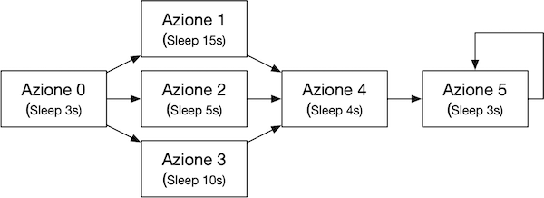

# Esercizio java Thread
Sviluppare un'applicazione java che permetta di simulare l'esecuzione delle operazioni come riportate nella figura sottostante. Ogni operazione (rappresentata con un box rettangolare in figura) deve stampare a video il proprio nome e il valore del contatore attività (vedere di seguito) e mettersi in attesa usando il metodo sleep per il numero di secondi indicato tra parentesi.

L'applicazione main deve definire un contatore intero **activityCounter** inizializzato a zero, e che viene incrementato da ogni operazione subito prima di terminare. L'incremento deve essere fatto in mutua esclusione.

Per la sincronizzazione dei thread utilizzare il metodo **join()**, oppure **wait()** e **notify/notifyAll()**, a scelta.

**Descrizione azioni da compiere:** eseguire **Azione 0**, al suo termine eseguire le **azioni 1**, **2**, **3** in parallelo. Dopo che tutte e 3 le azioni sono terminate eseguire **Azione 4** e, quando termina, ripetere **Azione 5** per 5 volte, sequenzialmente (cioè solo al termine di una esecuzione deve partire quella successiva).
