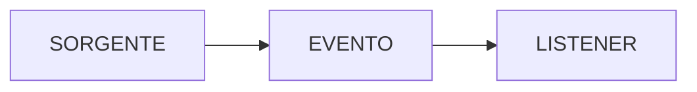

# Appunti GUI swift
Molti programmi interagiscono con l’utente attraverso una interfaccia grafica\
**GUI** - Graphical User Interface

Java fornisce diverse librerie di classi per la realizzazione di GUI.
Nelle primissime versioni di Java c'era una libreria:\
**AWT**(Abstract Window Toolkit) \
Per realizzare la portabilità a gestione dei componenti grafici era delegata ai toolkit nativi delle varie piattaforme (Windows, Unix, IoS, …)\
Successivamente è stata fornita la libreria **SWING**, che fa un uso molto ridotto dei toolkit nativi. I componenti sono *dipinti* in finestre vuote.\
In ogni caso, programmi Java che usano SWING, devono spesso usare anche classi AWT.\
### JFrame
Il componente di più alto livello di una interfaccia grafica è una finestra, realizzata dalla classe **JFrame**
```javascript
private static void mainOnEventDispatchThread() {
    // Create frame with title "Hello, World!"
    JFrame f = new JFrame("Hello, World!");
    // Dimensione della finestra
    f.setSize(400, 200);

    // Fa sì che il frame richieda alla JVM di terminare il programma
    // quando la finestra viene chiusa.
    f.setDefaultCloseOperation (JFrame.EXIT_ON_CLOSE);

    f.add(new JLabel("Hello, World!"));

    f.setVisible(true);
}
```
Inoltre, si può creare una classe che estende JFrame, e che nel suo costruttore ha tutti gli elementi del tipo di finestra desiderato:
```java
class Myframe extends JFrame {
    public MyFrame(String s) {
        super(s);
        setSize(400, 200);
        //add(new JLabel("ciao"));
    }
}
```
Per aggiungere un Bottone abbiamo la classe **JButton**\
Per inserirlo nel nostro frame basta passare il bottone come parametro al frame
```javascript
class Bottone(){
    button = new JButton("Click Me");
    panel = new JPanel();
    panel.add(button);
}
```
<sub>Andare a vedere bepper </sub>\
Se eseguiamo il Beeper notiamo che quando facciamo click sul bottone si sentirà il suono\
Come è possibile questa cosa? Attraverso gli eventi (event-driven programming)
### Programmazione guidata da eventi
<sub>I programmi tradizionali, ad esempio quelli che implementano algoritmi, hanno un comportamento funzionale: ricevono un input, eseguono la propria computazione e restituiscono un risultato.
Normalmente questi programmi seguono il proprio flusso di controllo e solo raramente possono contenere punti di diramazione che si basano su input dell'utente.
</sub>\
In molti casi invece, es. Interfacce grafiche, un programma deve avere un comportamento **reattivo**: ogni volta che l'utente genera un evento, il programma deve reagire all'evento eseguendo una azione opportuna.\
Quindi qualcosa genera degli eventi(utente di solito), questi eventi vengono catturati dall'event-handler che è un Gestore degli eventi che contiene il codice per gestire quell'evento (ad esempio il codice per fare beep).\
Il listener è un event handler.\
In Java **gli eventi sono Oggetti** derivati dalla classe EventObject.\
Esistono due tipi di eventi:
- **eventi semantici**: che fanno riferimento a quello che l'utente
  fa su componenti "virtuali" dell'interfaccia (premere un
  pulsante, selezionare la voce di un menu, ...)
- **eventi low-level**: ossia eventi fisici relativi al mouse o alla
  tastiera (tasto premuto, tasto rilasciato, mouse trascinato, ...)

Le **Sorgenti** degli eventi sono i diversi componenti dell'interfaccia, come JButton, JTextField, Component,
Window, ...\
In Java un _event-handler_, chiamato **listener**, è un'istanza di
una classe che contiene dei metodi per gestire gli eventi.\
Per ogni tipo di evento è definita una interfaccia che il
listener relativo deve implementare (ogni listener può
gestire eventi di un certo tipo). Es:
- ActionListener (eventi da bottoni)
- MouseListener (eventi del mouse)
- MouseMotionListener (spostamenti del mouse)
- WindowListener (eventi dovuti ad azioni su finestra - JFrame)
- ...

Gli eventi sono gestiti con un meccanismo di _delega_.\
La sorgente degli eventi, quando genera un evento, passa un **oggetto** che descrive l'evento ad un "listener" che
gestisce l'evento.\
Il _listener_ deve essere "registrato" presso la sorgente.
Il passaggio dell'evento causa l'invocazione di un metodo del listener.

Ad esempio i bottoni causano un solo tipo di evento: **ActionEvent**.\
La classe **ActionEvent** fornisce (fra l'altro) i metodi:
- String getActionCommand()
- Object getSource()

Il rispettivo **Listener** deve implementare l'interfaccia
```java
interface ActionListener {
    void actionPerformed(ActionEvent e);
}
```
Per registrare l'**ActionListener** nel bottone, si usa il metodo della classe **JButton**
```java
    void addActionListener(ActionListener l);
```
Per gestire un **ActionEvent** generato da un bottone, si deve:
- definire una classe che implementa l'interfaccia **ActionListener**, con il relativo metodo **actionPerformed();**
- creare un'istanza di questa classe;
- _registrarla_ presso il bottone, eseguendo il metodo **addActionListener()** del bottone stesso

Ogni volta che si preme il bottone, questo chiama
automaticamente il metodo **actionPerformed()** del listener
inviandogli l'evento.
È possibile registrare più listener nello stesso componente

### Tipi di eventi, eventHandlers e loro metodi
In generale, i nomi delle classi e delle operazioni relative
agli eventi seguono un _pattern_ comune.\
Se C è una classe (bottone, finestra, ...), i cui oggetti
possono generare eventi di tipo **XXX**, ci sarà:
- una classe **XXXEvent** che implementa gli eventi;
- una interface **XXXListener** con uno o più metodi per gestire l'evento;
- i metodi **addXXXListener()** o **removeXXXListener()** nella classe C.
### Classi Filtro (Adapters)
Alcune Interface prevedono tantissimi possibili eventi per gestire i vari tipi  di evento lanciati dalla sorgente degli eventi.\
Per esempio:
- **MouseListener**:
    - mouseExited(MouseEvent),
    - mousePressed(MouseEvent),
    - mouseReleased(MouseEvent),
    - mouseEntered(MouseEvent)
- **WindowListener**:
    - windowClosing(WindowEvent),
    - windowOpened(WindowEvent),
    - windowIconified(WindowEvent),
    - windowDeiconified(WindowEvent),
    - windowClosed(WindowEvent),
    - ecc....

I pattern d'implementazione dell'interfaccia richiede che il listener che vogliamo sviluppiate implementi tutti i suoi metodi, cosa che potrebbe non essere rilevante(magari ci interessa gestire un solo tipo di evento)\
Per questo motivo sono state introdotte le classi filtro, o **adapters**, che offrono le implementazioni di default delle interfacce dei listener con metodi che non fanno nulla\
Quindi Invece di implementare l'interfaccia del listener,
quando non si è interessati a gestire tutti i suoi eventi
si può estendere la classe adapter del listener e fare
overriding dei soli metodi di gestione di eventi che ci
servono
#### Esempio: gestione di eventi delle finestre (JFrame)

Quando si preme il pulsante di chiusura di una finestra,
viene generato un **WindowEvent** che deve essere
opportunamente gestito esempio con:
```java
    frame.setDefaultCloseOperation(JFrame.EXIT_ON_CLOSE);
```
così specifichiamo che quando chiudiamo la finestra deve terminare il processo.\
Però, se in chiusura di finestra volessimo fare anche altre
operazioni, questa istruzione non sarebbe sufficiente.\
Quindi servirebbe un listener con opportuno metodo di gestione
dell'evento.\
Infatti l'evento di chiusura della finestra può essere gestito come qualsiasi altro evento.\
Un **JFrame** genera un **WindowEvent** ogni volta che la finestra
cambia stato: aperta, chiusa, ridotta ad icona,...\
L'interfaccia WindowListener deve gestire tutti i possibili
cambiamenti di stato della finestra, e per questo contiene
sette metodi:
- windowActivated(WindowEvent e)
- windowClosing(WindowEvent e)
- ecc

Se a noi interessa solo il metodo windowClosing, per implementare correttamente l'interfaccia dovremmo comunque definire anche gli altri sei metodi.

Per risparmiare la fatica Java fornisce  la classe
**WindowAdapter**, che implementa l'interfaccia **WindowListener**
con i sette metodi che non fanno nulla.\
Noi dovremo solo estendere questa classe ridefinendo i
metodi che ci interessano. Nel nostro caso solo
**windowClosing**.\
<sub>vedi  Beeper4ButtonListenerConAdapter<\sub>

Il problema degli adapter è che non possiamo estendere altre classi perchè abbiamo l'ereditarietà singola.


