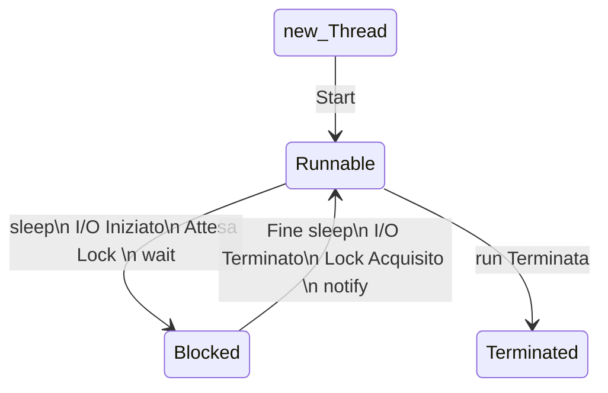

# Thread

**Thread**: flusso sequenziale di controllo (esecuzione di istruzioni) in un programma

Nello stesso programma si possono far partire più Thread che sono eseguiti in modo concorrente.

Tutti i _Thread_ condividono le stesse variabili del programma.

A differenza dai processi che hanno ciascuno il proprio contesto, PID, etc..

Un Thread viene visto come un lightweight process.

Nei computer a singola CPU la concorrenza viene simulata con una politica di scheduling che alterna l'esecuzione dei
singoli Thread.

Una applicazione Java che usa i Thread può eseguire più attività contemporaneamente. Esempio: aggiornare l'informazione
grafica sullo schermo e accedere alla rete.

In alcuni casi i Thread possono procedere in modo indipendente uno dall'altro (comportamento asincrono), in altri devono
essere sincronizzati fra loro (es. produttore - consumatore).

Ad esempio, quando un main crea una finestra (JFrame), viene attivato un Thread di GUI, diverso da quello del main()

Il costruttore del JFrame è eseguito dal Thread del main(), mentre il codice dei listener viene eseguito dal nuovo
Thread (che gestisce tutti i listener).
vedere a.contatore1.Contatore2

> **sleep(long _millis_)** :
\
> è un metodo di Thread che blocca l'esecuzione del Thread per il numero specificato di millisecondi
\
> Può generare una eccezione **InterruptedException**. Quindi è bene racchiuderla in un try-catch
\
> sleep è un metodo statico quindi può essere usato cosi: `Thread.sleep(...)`
\
> Può essere usato quindi anche da una classe che non deriva da Thread, per far bloccare l'esecuzione del Thread che lo
> esegue

> **currentThread()**:
\
> è un metodo di Thread che permette di sapere in quale Thread ci si trova in particolare
> con: `Thread.currentThread().getName()`
\
> Negli esempi possiamo vedere che quando si usa una interfaccia grafica, ci sono (almeno) due Thread. Uno per il main()
> e l'altro per la GUI

## Creazione di un Thread

Si definisce una classe che eredita da Thread e che ridefinisce il metodo run() per specificare le operazioni che il
Thread deve fare.
Il metodo run() di Thread non fa niente.\ 
**Per avviare un Thread si deve eseguire il metodo start()**, che manda in esecuzione un nuovo Thread e poi invoca **run()**; start() lancia una eccezione se viene invocato più di una volta. NB: se si invoca direttamente il metodo run(), questo viene eseguito ma non viene creato un nuovo Thread.
vedere b.provaThread

## Ciclo di vita di un Thread

Attenzione: Runnable NON significa running!\
Un Thread runnable può essere o meno in esecuzione.

Se c'è una sola CPU ci sarà al massimo un Thread in esecuzione ad ogni istante. L'effettiva esecuzione dipende dalla politica dello scheduler.\
La scelta di quale Thread eseguire e per quanto tempo è arbitraria (es. preemptive scheduling) cambia da sistema operativo a sistema operativo\
vedere c.dueThread

## Priorità dei Thread
I Thread hanno priorità di default, in [1, 10]. Es: il Thread del main ha priorità 5, quello dell'interfaccia grafica 6 vedi f.beeperThread

Si può assegnare ai Thread una **priorità** da 1 a 10 (metodo `setPriority(int priorityVal)`).

Lo scheduler darà la precedenza a Thread con priorità più alta.

Tuttavia la gestione delle priorità dipende fortemente dal sistema sottostante. Le 10 priorità di Java vengono mappate sulle priorità della piattaforma, che possono essere in numero diverso.

Vedere g.priority

## Gestione eccezioni nei Thread
Il metodo run() di un Thread non può fare throw di eccezioni controllate quindi vanno gestite tutte con opportuni handler (try e catch).

Se si verifica un'eccezione non controllata si blocca il Thread e si visualizza a video lo stack di esecuzione.

Volendo gestire le eventuali eccezioni non controllate:\
aggiungere al Thread un UncaughtExceptionHandler, implementando il suo metodo uncaughtException() per gestire le eccezioni.
Vedere h.gestioneEccezioni

## Interface Runnable

