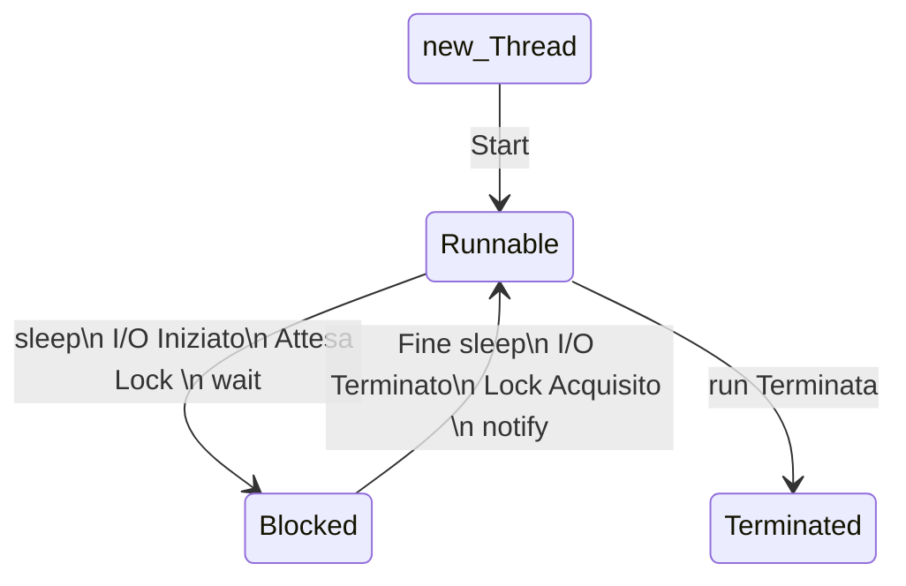

# Thread

**Thread**: flusso sequenziale di controllo (esecuzione di istruzioni) in un programma

Nello stesso programma si possono far partire più Thread che sono eseguiti in modo concorrente.

Tutti i _Thread_ condividono le stesse variabili del programma.

A differenza dai processi che hanno ciascuno il proprio contesto, PID, etc..

Un Thread viene visto come un lightweight process.

Nei computer a singola CPU la concorrenza viene simulata con una politica di scheduling che alterna l'esecuzione dei
singoli Thread.

Una applicazione Java che usa i Thread può eseguire più attività contemporaneamente. Esempio: aggiornare l'informazione
grafica sullo schermo e accedere alla rete.

In alcuni casi i Thread possono procedere in modo indipendente uno dall'altro (comportamento asincrono), in altri devono
essere sincronizzati fra loro (es. produttore - consumatore).

Ad esempio, quando un main crea una finestra (JFrame), viene attivato un Thread di GUI, diverso da quello del main()

Il costruttore del JFrame è eseguito dal Thread del main(), mentre il codice dei listener viene eseguito dal nuovo
Thread (che gestisce tutti i listener).
<sub>vedere a.contatore1.Contatore2


> **sleep(long _millis_)** :
\
> è un metodo di Thread che blocca l'esecuzione del Thread per il numero specificato di millisecondi
\
> Può generare una eccezione **InterruptedException**. Quindi è bene racchiuderla in un try-catch
\
> sleep è un metodo statico quindi può essere usato cosi: `Thread.sleep(...)`
\
> Può essere usato quindi anche da una classe che non deriva da Thread, per far bloccare l'esecuzione del Thread che lo
> esegue

> **currentThread()**:
\
> è un metodo di Thread che permette di sapere in quale Thread ci si trova in particolare
> con: `Thread.currentThread().getName()`
\
> Negli esempi possiamo vedere che quando si usa una interfaccia grafica, ci sono (almeno) due Thread. Uno per il main()
> e l'altro per la GUI

## Creazione di un Thread

Si definisce una classe che eredita da Thread e che ridefinisce il metodo run() per specificare le operazioni che il
Thread deve fare.
Il metodo run() di Thread non fa niente.\
**Per avviare un Thread si deve eseguire il metodo start()**, che manda in esecuzione un nuovo Thread e poi invoca *
*run()**; start() lancia una eccezione se viene invocato più di una volta. NB: se si invoca direttamente il metodo
run(), questo viene eseguito ma non viene creato un nuovo Thread.
<sub>vedere b.provaThread

## Ciclo di vita di un Thread



Attenzione: Runnable NON significa running!\
Un Thread runnable può essere o meno in esecuzione.

Se c'è una sola CPU ci sarà al massimo un Thread in esecuzione ad ogni istante. L'effettiva esecuzione dipende dalla
politica dello scheduler.\
La scelta di quale Thread eseguire e per quanto tempo è arbitraria (es. preemptive scheduling) cambia da sistema
operativo a sistema operativo\
<sub>vedere c.dueThread

## Priorità dei Thread

I Thread hanno priorità di default, in [1, 10]. Es: il Thread del main ha priorità 5, quello dell'interfaccia grafica
6 <sub>vedi f.beeperThread

Si può assegnare ai Thread una **priorità** da 1 a 10 (metodo `setPriority(int priorityVal)`).

Lo scheduler darà la precedenza a Thread con priorità più alta.

Tuttavia la gestione delle priorità dipende fortemente dal sistema sottostante. Le 10 priorità di Java vengono mappate
sulle priorità della piattaforma, che possono essere in numero diverso.

<sub>Vedere g.priority

## Gestione eccezioni nei Thread

Il metodo run() di un Thread non può fare throw di eccezioni controllate quindi vanno gestite tutte con opportuni
handler (try e catch).

Se si verifica un'eccezione non controllata si blocca il Thread e si visualizza a video lo stack di esecuzione.

Volendo gestire le eventuali eccezioni non controllate:\
aggiungere al Thread un `UncaughtExceptionHandler`, implementando il suo metodo `uncaughtException()` per gestire le
eccezioni.\
<sub>Vedere h.gestioneEccezioni

## Interface Runnable

Abbiamo visto come creare dei Thread, quindi ogni Thread è un oggetto che esegue il codice che c'è nella propria `run()`
e viene lanciato attraverso il metodo `start()`\
In realtà non è corretto lavorare come abbiamo visto, quindi creare un Thread per ogni tipo di lavoro che venga fatto.\
Quindi si definisce una classe che implementa l'interfaccia `Runnable` che possiede il metodo `run()` e dentro al
metodo `run()` andiamo a scrivere il **task** da compiere

```java
class Esempio implements Runnable {
    public void run() {
        //codice del task 
    }
}
```

Adesso per attivare un Thread è necessario creare un **Thread** passando come parametro al costruttore un oggetto *
*Runnable**.\
Quando si fa partire il Thread con `start()`, inizia l'esecuzione del metodo `run()` nel nuovo Thread.

```java
Esempio es=new Esempio();
        Thread t=new Thread(es);
        t.start();
```

<sub>Vedere i.runnable.runnable0\
runnable0:

```java
class MyRun implements Runnable {
    public void run() {
        System.out.println(Thread.currentThread().getName());
    }
}

class ProvaRunnable {
    public static void main(String[] args) {
        MyRun mr = new MyRun();// ogni start fa partire un nuovo thread;
        new Thread(mr).start();
        new Thread(mr).start();
    }
}
```

Questo modo di creare i Thread deve essere usato quando la classe contenente il metodo `run()` è già sottoclasse di
un'altra classe.\
**In generale, usare i Runnable è utile per separare le specifiche delle istruzioni da eseguire in un flusso parallelo
rispetto all'esecutore, che è l'oggetto Thread.**
<sub>Vedere i.runnable.runnable1\
runnable1:

```java
class MiaClasse implements Runnable {
    private int i = 0;

    public void run() {
        i++;
        System.out.println("i = " + i);
        System.out.println("nella run- thread  " + Thread.currentThread().getName() + ": i = " + i);
    }
}

class ProvaRunnable2 {
    public static void main(String[] args) {
        MiaClasse r = new MiaClasse();
        Thread t1, t2;// NB: poichè t1 e t2 eseguono il metodo run() dello stesso oggetto,
        // modificano la stessa variabile
        t1 = new Thread(r);
        t2 = new Thread(r);
        t1.start();
        t2.start();
        System.out.println("thread: " + Thread.currentThread().getName());
    }
}
```

La variabile `i` viene incrementata due volte. Infatti esiste un unico oggetto di **MiaClasse**, legato alla
variabile `r`, che ha una variabile locale `i`.\
I Thread `t1` e `t2` eseguono entrambi il metodo `run()` di questo oggetto e incrementano la stessa variabile `i`.

    
---
    
Naturalmente la computazione dei vari Thread può procedere con ordini diversi.\
Ad esempio, il Thread del `main()` può terminare prima dei Thread `t1` e `t2`, oppure viceversa.

Per avere la traccia di tutti gli stack in un qualunque punto della computazione si può usare il metodo
statico `getAllStackTraces()` della classe Thread, che restituisce un `Map<Thread, StackTraceElement[]>`.

Ad ogni Thread attivo al momento della chiamata, viene associato un array di **StackTraceElem**\
<sub>Vedere j.tracciaStack

## Attesa terminazione di Thread (metodi join())

Un Thread può chiamare il metodo `join()` su un altro Thread `t` per **aspettare che `t` sia terminato** prima di
continuare la propria esecuzione.\
Se un Thread chiama `t.join()` su un altro Thread `t`, il Thread chiamante viene sospeso finché `t` termina l’esecuzione
del proprio metodo `run()`.

NB: il metodo `join()` va invocato DOPO aver fatto partire il Thread da attendere, altrimenti non è bloccante per chi lo
invoca.\
<sub>Vedere k.join
Es:

```java
public class JoinApp {

    public static void main(String[] args) {
        Thread t1 = new MyThread(800);
        /*Se metto qui la join il main termina prima di t1 */
        try {
            t1.join();
        } catch (InterruptedException e) {
            System.out.println(e.getMessage());
        }

        t1.start();
        try {
            t1.join();
        } catch (InterruptedException e) {
            System.out.println(e.getMessage());
        }
        Thread t2 = new MyThread(300);
        t2.start();
        try {
            t2.join();
        } catch (InterruptedException e) {
            System.out.println(e.getMessage());
        }
        System.out.println("IL MAIN è FINITO!");
    }
}

class MyThread extends Thread {
    private int num;

    public MyThread(int num) {
        super();
        this.num = num;
    }

    public void run() {
        for (int i = 1; i < 4; i++) {
            System.out.println("Sono il thread " + getName());
            try {
                sleep(num);
            } catch (InterruptedException e) {
                return;
            }
        }
        System.out.println("DONE! " + getName());
    }
}
```

<sub>Vedere anche l.scheduling

## Thread Demoni

L'esecuzione di un programma termina quando sono terminati tutti i Thread attivati. Un Thread può essere dichiarato
come "daemon".\
Un "**daemon**" è un Thread normale, che però non influenza la terminazione del programma.

Un programma termina quando sono terminati _tutti_ i Thread non-daemon. Se ci sono dei daemon attivi, la loro esecuzione
viene terminata.

Per rendere un Thread Demone invocare il metodo `setDaemon(true)` prima del metodo `start()`.

```java
class myDaemon extends Thread {
    public myDaemon() {
        setDaemon(true);
    }

    public void run() {
        //...
    }
}
```

<sub>Vedere m.daemons

